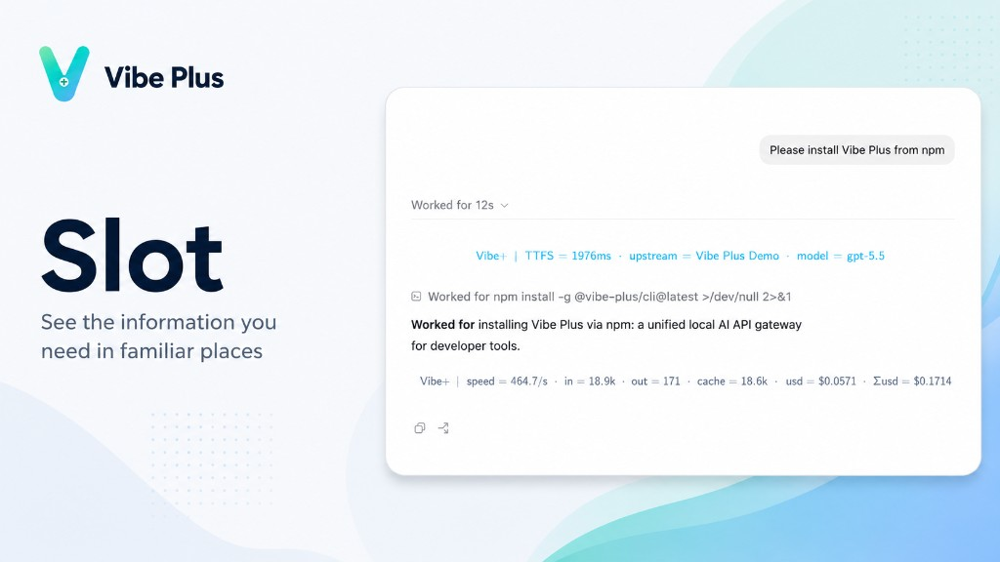

# Vibe Plus

Local gateway for AI coding tools. You run it from the **web dashboard**.

## Install & run

**Node (npm)**

```bash
npm install -g @vibe-plus/cli && npx vibe
```

**Bun**

```bash
bun install -g @vibe-plus/cli && bunx vibe
```

Install, open the dashboard, import credentials — done. Data stays on your machine in `~/.vibe`.

## Features

### Slot



### Unified history

### Wave routing

---

**Why bother?** One place for providers and keys instead of editing every app by hand.

## License

[PolyForm Noncommercial 1.0.0](LICENSE) — noncommercial use only.
