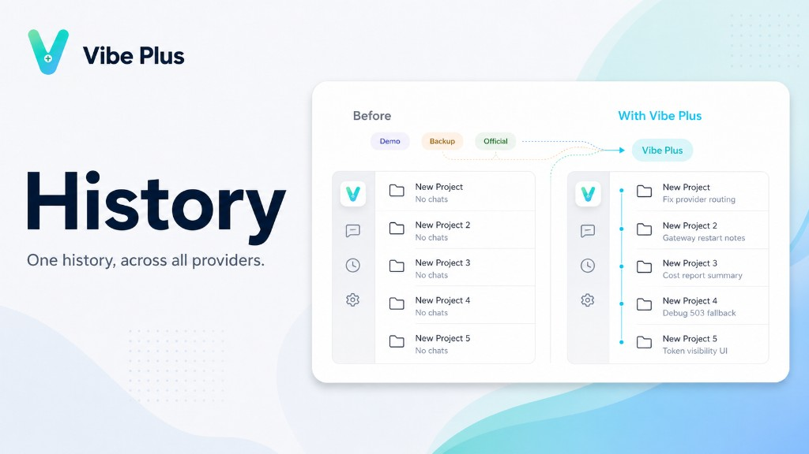
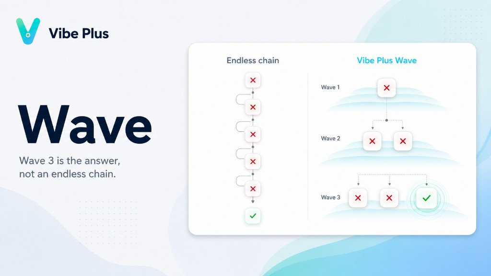

# Vibe Plus

本地 AI API 网关，给 Claude Code / Codex / OpenCode 用。**控制台是网页**。

[控制台](https://vibe-plus.github.io/vibe-plus/) · [](https://linux.do/u/cheezone)

## 安装

**Node（npm）**

```bash
npm install -g @vibe-plus/cli && npx vibe
```

**Bun**

```bash
bun install -g @vibe-plus/cli && bunx vibe
```

执行 `vibe` 会启动网关、注册开机自启（macOS / Windows）、接管客户端、打开控制台。数据全在 `~/.vibe`。

## 功能

### Slot

在你熟悉的位置看到你需要的信息。


### 统一历史

一份历史，跨所有供应商。



### Wave 路由

第 3 波就是答案，不是无尽的重试链。



---

**为什么用？** 集中管供应商和 Key，不用挨个去改每个客户端。

## 许可证

[PolyForm Noncommercial 1.0.0](LICENSE) —— 仅限非商业使用。

---

# Vibe Plus (English)

Local gateway for AI coding tools. You run it from the **web dashboard**.

[Dashboard](https://vibe-plus.github.io/vibe-plus/) · [](https://linux.do/u/cheezone)

## Install & run

**Node (npm)**

```bash
npm install -g @vibe-plus/cli && npx vibe
```

**Bun**

```bash
bun install -g @vibe-plus/cli && bunx vibe
```

Install, open the dashboard, import credentials — done. Data stays on your machine in `~/.vibe`.

**Why bother?** One place for providers and keys instead of editing every app by hand.

## License

[PolyForm Noncommercial 1.0.0](LICENSE) — noncommercial use only.
